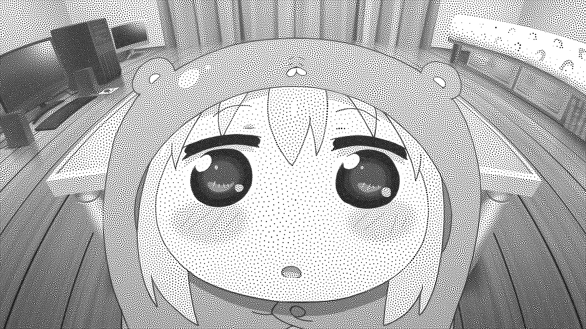
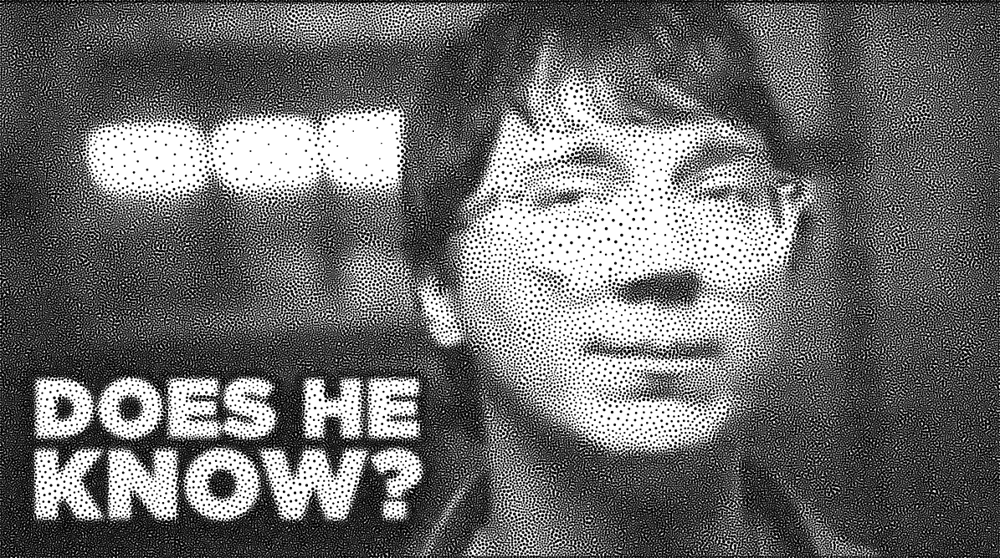
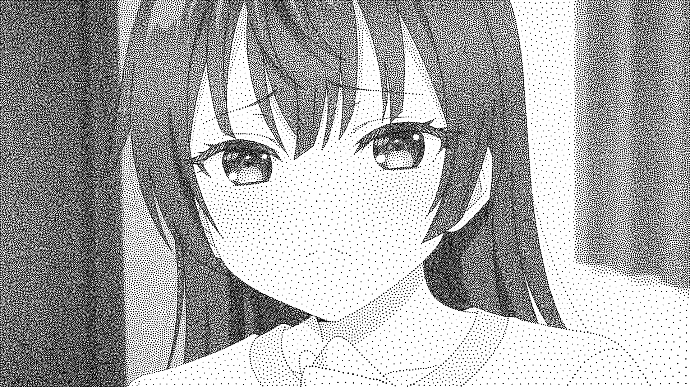

# Stipple-Me-This

Program ini menggunakan **Lloyd's Algorithm** (weighted Voronoi stippling versi Adrian Secord), yang diimplementasikan dalam **empat varian** yaitu serial, paralel CPU (OpenMP), vektorisasi SIMD (AVX2), dan akselerasi GPU (CUDA), lengkap dengan benchmarking, animasi GIF, dan juga interface Qt.

```
Stipple-Me-This/
├── Makefile                  # build (CPU + CUDA)
├── scripts/
│   └── bench.sh              # build + benchmark contoh Umaru
├── third_party/              # stb_image.h, stb_image_write.h (single-header)
├── sample/                   # gambar uji (dibangkitkan otomatis)
└── src/
    ├── main.cpp              # CLI, progress terminal, benchmark harness, launcher GUI
    ├── gui.hpp/.cpp          # GUI Qt: form parameter, progress, dan preview hasil
    ├── stipple.hpp/.cpp      # tipe data, weighted sampling, update centroid, rendering
    ├── image.hpp/.cpp        # I/O gambar (stb) + encoder GIF sendiri
    ├── serial.cpp            # implementasi serial (baseline scalar)
    ├── openmp.cpp            # paralelisme thread + per-thread accumulator
    ├── simd.cpp              # AVX2: vektorisasi inner loop 8 titik sekaligus
    ├── cuda_stippler.cu      # kernel CUDA (1 thread = 1 piksel + atomicAdd)
    └── gif_writer.hpp        # encoder GIF89a+LZW minimal, tanpa dependensi
```

---

## Jurnal Proses

Pertama-tama, disini saya mencari tahu terlebih dahulu apa yang dimaksud dengan Lloyd's Algorithm pada soal. Selama proses pencarian tersebut, saya menemukan paper berikut [*Weighted Voronoi Stippling*](https://www.cs.ubc.ca/labs/imager/tr/2002/secord2002b/secord.2002b.pdf), yang menjelaskan penggunaan *weighted centroidal Voronoi diagram* untuk melakukan stippling.

Ide dasar dari paper tersebut adalah dengan memperlakukan setiap titik stipple sebagai *site* Voronoi. Setiap piksel akan diberikan kepada titik terdekat, kemudian titik tersebut nantinya akan dipindahkan menuju centroid selnya. Centroid pada program ini akan diberi bobot berdasarkan tingkat saturasi kegelapan dari gambar. Oleh karena itu, daerah gelap akan menarik lebih banyak titik, sedangkan piksel putih tidak ikut memengaruhi posisi centroid. Proses *assignment* dan *update* ini akan diulang terus sampai pergeseran titik cukup kecil atau jumlah iterasi maksimum tercapai.

### 1. Mengubah gambar menjadi peta densitas

Tahap pertama yang saya implementasikan adalah membaca gambar sebagai grayscale dengan `stb_image`, lalu mengubah luminance menjadi densitas tinta. Nilai luminance `0` berarti hitam dan `255` berarti putih, sehingga densitas dasarnya dihitung dengan `255 - luminance`. Parameter `gamma` dipakai untuk mengatur kontras distribusi titik. Setelah itu, operator Sobel menambahkan bobot pada kontur supaya bentuk objek lebih terjaga.

```cpp
std::vector<float> baseD(P);
for (int i = 0; i < P; ++i) {
    float d = 255.0f - (float)out.lum[i];
    if (gamma != 1.0f && d > 0.0f) {
        d = 255.0f * std::pow(d / 255.0f, gamma);
    }
    baseD[i] = d;
}
```

Nilai `baseD` inilah yang kemudian dipakai pada seluruh implementasi Lloyd. Dengan pemisahan ini, serial, OpenMP, SIMD, dan CUDA menerima data input yang sama sehingga perbandingan hasil dan waktunya lebih adil.

### 2. Membuat implementasi serial sebagai baseline

Menurut saya, versi serial bisa dibilang yang paling gampang untuk diimplementasikan. Makanya disini saya terlebih dahulu mengerjakannya karena bisa menjadi acuan untuk seluruh optimasi yang bisa dilakukan berikutnya. Untuk setiap piksel yang memiliki densitas, program mencari titik terdekat menggunakan jarak Euclidean kuadrat. Akar kuadrat tidak diperlukan pada tahap pencarian karena tidak akan mengubah urutan dari jarak.

```cpp
for (int i = 0; i < w * img.h; ++i) {
    float d = density[i];
    if (d <= 0.0f) continue;

    float px = (float)(i % w) + 0.5f;
    float py = (float)(i / w) + 0.5f;
    int bi = AssignCore::nearestPoint(px, py, n,
        [&](int j, float px_, float py_) {
            float dx = px_ - xs[j], dy = py_ - ys[j];
            return dx * dx + dy * dy;
        });

    sw[bi] += d;
    sxw[bi] += px * d;
    syw[bi] += py * d;
}
```

Tiga akumulator tersebut memiliki fungsi yang berbeda: `sw` menyimpan total bobot sel, sedangkan `sxw` dan `syw` menyimpan jumlah koordinat yang telah dikalikan bobot. Setelah seluruh piksel selesai diproses, centroid baru dihitung dengan rumus `x = sxw / sw` dan `y = syw / sw`.

```cpp
for (int j = 0; j < n; ++j) {
    cellWeightOut[j] = sw[j];
    if (sw[j] > 1e-6f) {
        float nx = sxw[j] / sw[j];
        float ny = syw[j] / sw[j];
        float dx = nx - xs[j];
        float dy = ny - ys[j];
        maxDisp = std::max(maxDisp, dx * dx + dy * dy);
        xs[j] = nx;
        ys[j] = ny;
    }
}
return std::sqrt(maxDisp);
```

Jika `maxDisp < epsilon`, maka loop Lloyd akan dihentikan lebih awal. Sel yang tidak memperoleh bobot akan dibiarkan pada posisi sebelumnya agar tidak terjadi pembagian dengan nol.

### 3. Memparalelkan assignment dengan OpenMP

Setelah serial berjalan, saya memindahkan loop atas dari piksel ke OpenMP. Kendala utamanya adalah banyak piksel bisa masuk ke sel yang sama. Kalau semuanya langsung melakukan write ke `sw`, `sxw`, dan `syw`, maka akan terjadi *data race*. Solusinya adalah dengan menyediakan akumulator lokal untuk setiap threadnya.

```cpp
#pragma omp parallel
{
    const int tid = omp_get_thread_num();
    float* mySw = lsw[tid].data();
    float* mySxw = lsxw[tid].data();
    float* mySyw = lsyw[tid].data();

#pragma omp for schedule(static)
    for (int i = 0; i < P; ++i) {
        float d = density[i];
        if (d <= 0.0f) continue;
        float px = (float)(i % w) + 0.5f;
        float py = (float)(i / w) + 0.5f;
        int bi = AssignCore::nearestPoint(px, py, n,
            [&](int j, float px_, float py_) {
                float dx = px_ - xs[j], dy = py_ - ys[j];
                return dx * dx + dy * dy;
            });
        mySw[bi] += d;
        mySxw[bi] += px * d;
        mySyw[bi] += py * d;
    }
}
```

Setelah region paralel selesai, semua akumulator lokal direduksi ke akumulator utama:

```cpp
for (int t = 0; t < T; ++t)
    for (int j = 0; j < n; ++j) {
        sw[j] += lsw[t][j];
        sxw[j] += lsxw[t][j];
        syw[j] += lsyw[t][j];
    }
```

Pendekatan ini dibuat untuk menghindari `atomic` pada CPU. Hasil numeriknya bisa saja berbeda dan tidak konsisten dari serial karena urutan penjumlahan dari floating-point berubah, tapi algoritma dan aturan centroid yang dipakai masih sama.

### 4. Memproses delapan titik sekaligus dengan SIMD AVX2

Tahap berikutnya yang saya lakukan adalah melakukan vektorisasi pada loop titik menggunakan AVX2. Satu register `__m256` akan menampung delapan nilai `float`, sehingga delapan kandidat titik bisa untuk diperiksa secara sekaligus.

```cpp
const __m256 vx = _mm256_loadu_ps(xs + j);
const __m256 vy = _mm256_loadu_ps(ys + j);
const __m256 dx = _mm256_sub_ps(vpx, vx);
const __m256 dy = _mm256_sub_ps(vpy, vy);
const __m256 d2 = _mm256_fmadd_ps(dx, dx, _mm256_mul_ps(dy, dy));

const __m256 maskf = _mm256_cmp_ps(d2, vmin, _CMP_LT_OQ);
vmin = _mm256_blendv_ps(vmin, d2, maskf);
const __m256 vidx = _mm256_add_ps(vlane, _mm256_set1_ps((float)j));
vmini = _mm256_blendv_ps(vmini, vidx, maskf);
```

`_mm256_fmadd_ps` menghitung `dx² + dy²`, sedangkan mask hasil dari perbandingan akan memilih jarak dan indeks yang terbaik pada tiap lane. Setelah loop vektor selesai, nilai minimum dari delapan lane akan direduksi secara scalar. Jika jumlah titik bukan kelipatan delapan, maka sisa titik juga tetap diperiksa oleh loop scalar.

### 5. Memindahkan assignment ke GPU dengan CUDA

Versi berikutnya adalah dengan memetakan satu thread CUDA ke satu piksel. Setiap thread akan mencari titik terdekat sendiri, lalu menambahkan kontribusinya ke akumulator sel dengan menggunakan `atomicAdd`.

```cpp
int i = blockIdx.x * blockDim.x + threadIdx.x;
if (i >= P) return;
float d = density[i];
if (d <= 0.0f) return;

float px = (float)(i % w) + 0.5f;
float py = (float)(i / w) + 0.5f;
float best = INFINITY;
int bi = 0;
for (int j = 0; j < n; ++j) {
    float dx = px - xs[j];
    float dy = py - ys[j];
    float d2 = dx * dx + dy * dy;
    if (d2 < best) { best = d2; bi = j; }
}

atomicAdd(&sw[bi], d);
atomicAdd(&sxw[bi], px * d);
atomicAdd(&syw[bi], py * d);
```

Disini, centroid masih akan dihitung di host karena jumlah titik jauh lebih kecil daripada jumlah piksel yang ada. Pada implementasi awal, saya lupa mengirim posisi centroid baru ke device. Akibatnya, kernel selalu menggunakan posisi awal dan program tampak konvergen setelah dua iterasi. Perbaikannya adalah dua penyalinan berikut setelah `updateCentroids`:

```cpp
CUDA_CHECK(cudaMemcpy(d_xs, xs.data(), (size_t)n * sizeof(float),
                      cudaMemcpyHostToDevice));
CUDA_CHECK(cudaMemcpy(d_ys, ys.data(), (size_t)n * sizeof(float),
                      cudaMemcpyHostToDevice));
```

### 6. Merender titik menjadi PNG dan GIF

Sesudah iterasinya selesai, posisi dari titik dirender akan kembali di atas blank canvas. Radius dasarnya akan mengikuti luas area gelap per titik, lalu akan disesuaikan dengan menggunakan bobot sel supaya daerah dengan massa tinta lebih besar menghasilkan titik yang lebih besar.

```cpp
const double r0 = std::sqrt(img.darkArea / (n * M_PI)) * radiusScale;

double r = r0;
if (cellWeight.size() == (size_t)n && meanW > 0.0) {
    double scale = std::sqrt((double)cellWeight[j] / meanW);
    r = r0 * std::clamp(scale, 0.4, 1.7);
}
```

PNG ditulis menggunakan `stb_image_write`. Untuk fitur animasi, callback setiap iterasi dapat merender posisi titik saat itu sebagai frame.

## Cara Build dan Run

### Persyaratan

- Linux (diuji di WSL2 Ubuntu 24.04) dengan gcc 13+ (`build-essential`)
- Qt 6 development package (`qt6-base-dev`) dan `pkg-config`
- CUDA Toolkit **Linux** (diuji dengan 13.3, GTX 1660 Ti / compute capability 7.5)
- GPU NVIDIA dengan driver di sisi host (di WSL2: driver Windows menangani passthrough)
- `python3` + Pillow (hanya untuk generate gambar sample; program inti tidak butuh)

### Setup CUDA toolkit untuk Linux

Repo NVIDIA (`https://developer.download.nvidia.com/compute/cuda/repos/ubuntu2404/x86_64/`) menyediakan paket `.deb` yang bisa diekstrak biasa (bukan install sistem):

```bash
mkdir -p ~/cuda-13.3
cd ~ && for f in \
    cuda-nvcc-13-3_13.3.73-1_amd64.deb \
    cuda-cudart-13-3_13.3.29-1_amd64.deb \
    cuda-cudart-dev-13-3_13.3.29-1_amd64.deb \
    libnvvm-13-3_13.3.73-1_amd64.deb \
    cuda-crt-13-3_13.3.73-1_amd64.deb \
    libnvptxcompiler-13-3_13.3.73-1_amd64.deb; do
  curl -sL -o /tmp/$f https://developer.download.nvidia.com/compute/cuda/repos/ubuntu2404/x86_64/$f
  dpkg-deb -x /tmp/$f ~/cuda-13.3
done
~/cuda-13.3/usr/local/cuda-13.3/bin/nvcc --version   # verifikasi
```
### Build

```bash
make -j$(nproc)
```

### Running Programs

```bash
# mode tunggal (5 parameter wajib)
./stipple --input sample/target.png --points 2000 --iters 60 --eps 0.05 --output output/hasil.png

# pilih implementasi & optimasi kualitas stippling (gamma, radius-scale, edge)
./stipple --input does_he_know__by_deranfang141_dl34gc6-pre.jpg --points 80000 --iters 40 --eps 0.3 --gamma 1.4 --radius-scale 1.0 --edge 0.35 --impl cuda --output output/hasil.png

# pilih implementasi CPU & thread
./stipple ... --impl openmp --threads 8

# benchmark semua implementasi dengan contoh Umaru
./stipple --bench --input output/umaru_stipple.png --points 1000 --iters 10 --eps 0.2 --output output/bench_umaru.png

# animasi GIF (frame tiap 2 iterasi)
./stipple ... --impl cuda --gif output/anim.gif --gif-every 2

# buka GUI (jalankan tanpa argumen)
./stipple

# alternatif eksplisit
./stipple --gui

# build + benchmark
./scripts/bench.sh
```

Parameter wajib: `--input` (gambar sumber), `--points` (jumlah titik), `--iters` (maksimal iterasi), `--eps` (epsilon/toleransi), `--output` (gambar hasil).
Opsi optimasi visual: `--gamma` (kontras densitas, default: 1.4), `--radius-scale` (skala radius dot Secord, default: 1.0), `--edge` (penajaman kontur Sobel, default: 0.35).

### GUI

Jalankan `./stipple` atau `./stipple --gui`. GUI memproses gambar pada background thread sehingga jendela tetap responsif selama algoritma berjalan.

| Kontrol GUI | Fungsi | Default |
|---|---|---:|
| Path gambar | Gambar sumber; dapat dipilih dengan file picker | wajib dipilih |
| Jumlah titik | Banyak titik stipple | 2000 |
| Maksimal iterasi | Batas iterasi Lloyd | 50 |
| Epsilon | Ambang konvergensi pergeseran titik | 0.10 |
| Path output | Lokasi PNG hasil; dapat dipilih dengan file picker | `output/<nama>_stipple.png` |
| Implementasi | `serial`, `openmp`, `simd`, atau `cuda` | `serial` |

Tekan **Proses Gambar** untuk memulai pemrosesannya. Selama komputasinya berlangsung, GUI nantinya akan langsung menampilkan progress untuk iterasi, `max displacement`, elapsed time, dan juga ETA. Setelah pemrosesan yang dilakukan selesai, hasil gambarnya akan langsung ditampilkan pada panel preview dengan aspect ratio tetap yang sudah diatur pada program. Statistik konvergensi, waktu komputasi, ukuran gambar, dan lokasi file output juga ditampilkan di panel informasi pemrosesan.

---

## Strategi Implementasi

### Algoritma inti: weighted Lloyd

Berikut merupakan urutan tiap iterasi yang dilakukan pada algoritma weighted Lloyd:

1. **Assignment** — tiap piksel di-assign ke titik terdekat (jarak Euclidean kuadrat). Piksel putih (`density = 255 - luminance = 0`) dilewati karena tidak memengaruhi centroid sama sekali.
2. **Update** — centroid sel `j`: `x̄ = Σ(w·x)/Σw`, `ȳ = Σ(w·y)/Σw`, dengan bobot `w = ink density` piksel. Titik dipindahkan ke centroid.
3. **Stop** — bila pergeseran maksimum semua titik `< epsilon`, iterasi dihentikan lebih awal.

Kompleksitas tiap iterasi: **O(piksel gelap × jumlah titik)** — tahap assignment mendominasi hampir seluruh waktu.

**Inisialisasi:** weighted random sampling — prefix-sum kumulatif densitas, lalu tiap titik di-sample proporsional densitas (binary search). Piksel gelap lebih mungkin jadi lokasi awal, sehingga konvergensi cepat dan stabil.

### Paralelisasi

Ketiga versi paralel mengeksploitasi fakta bahwa loop assignment atas piksel sepenuhnya independen per piksel:

| Versi | Strategi |
|---|---|
| **Serial** | Loop scalar murni; baseline referensi kebenaran. |
| **OpenMP** | `#pragma omp parallel for` atas piksel. Setiap thread punya akumulator lokal `sw/sxw/syw` (ukuran N) lalu di-reduce — menghindari atomic contention; perbedaan urutan penjumlahan dapat menimbulkan deviasi floating-point kecil dari serial. |
| **SIMD AVX2** | Inner loop (atas titik) divektorisasi: 8 titik diproses per instruksi (`_mm256_*` + FMA), argmin dilacak dengan `blendv` bermask. Dikombinasikan dengan OpenMP di outer loop. |
| **CUDA** | Kernel `assignKernel`: 1 thread = 1 piksel, mencari titik terdekat, lalu `atomicAdd` ke akumulator sel (3 array float). Centroid tetap dihitung di host (N kecil), posisi titik disalin balik tiap iterasi. |

### Benchmarking

Harness `--bench`: tiap implementasi dijalankan 1× warm-up lalu 3× diukur, diambil waktu terbaik; seed sama agar titik awal identik; deviasi posisi akhir vs serial ikut dilaporkan.

---

## Hasil Benchmark

<p align="center">
  
</p>

1920×1080, 1.000 titik, maksimal 10 iterasi, ε = 0,2, seed 42. Setiap implementasi dijalankan satu kali warm-up dan tiga kali pengukuran; tabel memakai waktu terbaik.

| Implementasi | Iterasi | Konvergen | Total (ms) | ms/iterasi | Speedup | Deviasi vs serial |
|---|---:|---:|---:|---:|---:|---:|
| Serial | 10 | Tidak | 8.397,55 | 839,75 | 1,00× | — |
| OpenMP | 10 | Tidak | 1.392,53 | 139,25 | **6,03×** | 0,687992 px |
| SIMD | 10 | Tidak | 299,38 | 29,94 | **28,05×** | 0,687992 px |
| CUDA | 10 | Tidak | 64,11 | 6,41 | **130,98×** | 1,213768 px |

---

## Sample Results

<p align="center">
  
  
  
  
  
</p>

---

## Jalan Buntu atau Bug Aneh yang terjadi selama pengerjaan

### 1. CUDA toolkit di `S:/` (drive berbeda) tidak bisa langsung dipakai di WSL

Jadi awalnya, untuk CUDA toolkit ini sendiri saya install langsung di environment Windows. Nah saya pikir tinggal langsung set `PATH` aja ke `S:/NVIDIA GPU Computing Toolkit/CUDA/v13.3/bin`. Namun kenyataannya, meskipun `nvcc.exe` Windows bisa dipanggil dari WSL lewat interop dan menghasilkan `.exe` (PE32+), tapi binary tersebut berjalan di *Windows*, dengan semua konsekuensi path dan I/O. Jadi mau gak mau ya harus install CUDA toolkit di WSL sendiri.

### 2. Bug fake convergence di versi CUDA (2 iterasi)

Versi CUDA awalnya "konvergen" setelah 2 iterasi. Yang menyebabkan ini bisa terjadi adalah posisi dari titik hasil update centroid hanya di-update di **host** dan tidak disalin kembali ke **device**. Jadinya kernel pada setiap iterasi akan menghitung Voronoi dari titik awal yang sama. Perbaikannya adalah dengan menambahkan`cudaMemcpy` posisi titik host→device pada tiap iterasi.

### 3. Encoder GIF: "broken data stream"

Dua bug terpisah di encoder GIF89a:

1. **Sub-block length di akhir, bukan awal.** Format GIF: `[panjang][data...]` per sub-block. Implementasi awal menulis semua byte data lalu menaruh panjang di akhir → decoder membaca byte data pertama (kebetulan `0x00`) sebagai panjang = 0 → "empty block". Perbaikan: buffer per sub-block, flush `[0xFF][255 byte]` saat penuh, `[sisa][byte sisa][0x00]` di akhir.
2. **Off-by-one code-size LZW.** Code size (9→10→11→12 bit) dinaikkan *setelah* counter increment: cek `nextCode == (1 << codeSize)` dilewatkan saat nilai tepat 512 (sudah jadi 513), sehingga encoder mengirim kode 512..1023 pada 9 bit sementara decoder sudah beralih ke 10 bit. Perbaikan (sinkron dengan `gifenc` yang terbukti benar): cek sebelum menambah entry, `if (nextCode == (1 << codeSize)) ++codeSize;`.

---

## Fitur Bonus

- **Animasi GIF** (4 poin)
- **GUI interaktif** (s.d. 3 poin)
- **Vektorisasi SIMD** (3 poin): inner loop AVX2 (8 titik/instruksi, FMA)

---

## Kesimpulan

- CUDA memberi speedup terbesar (130,98× pada benchmark di atas) karena assignment O(P×N) dapat dibagi menjadi satu thread per piksel.
- SIMD AVX2 mencapai 28,05× tanpa overhead transfer host-device.
- OpenMP mencapai 6,03× dengan membagi loop piksel ke beberapa core CPU.